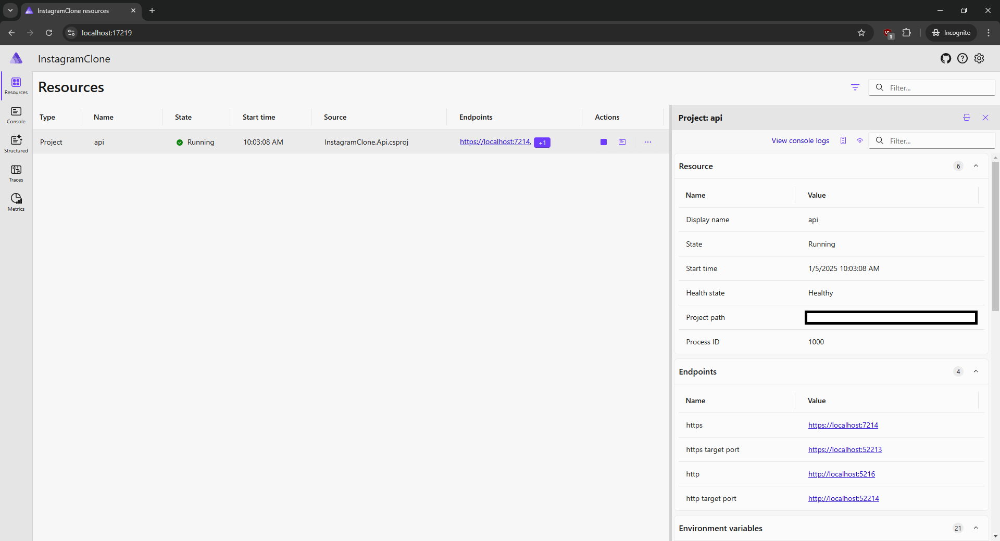
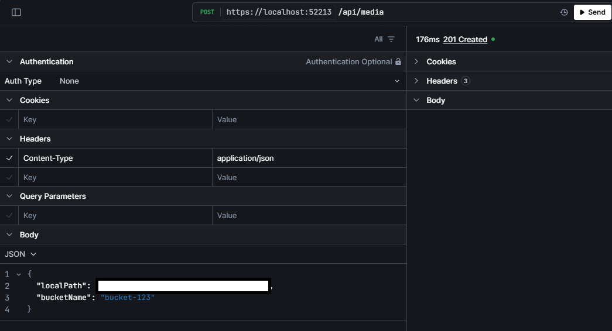
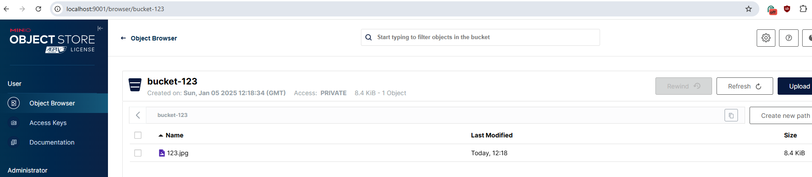

# InstagramClone
Work in progress Instagram clone made with .NET 9.0, .NET Aspire (orchestration, observability), MinIO (object storage) and PostgreSQL (DB).

## Solution structure
- `InstagramClone.AppHost`: main entry point of the application, orchestrating other projects using .NET Aspire.
- `InstagramClone.Api`: API project. Uses ASP.NET Core Identity to handle authentication, generates OpenAPI documents and has [Scalar](https://github.com/scalar/scalar) client.
- `InstagramClone.ServiceDefaults`: class library that adds common .NET Aspire services. Used by `InstagramClone.Api`.

## Running locally with Docker

Please perform these steps in the sequence they are listed.

### MinIO

This command will create and use `C:/docker-sandbox/minio` directory as a persistent storage for the container. You can use any other file path that you have read, write and delete access. More information can be found in MinIO documentation [here](https://min.io/docs/minio/container/index.html#procedure). 

`docker run -p 9000:9000 -p 9001:9001 --name minio1 -v C:/docker-sandbox/minio:/data -e "MINIO_ROOT_USER=ROOTUSER" -e "MINIO_ROOT_PASSWORD=CHANGEME123" -d --rm  quay.io/minio/minio:RELEASE.2024-12-18T13-15-44Z server data --console-address ":9001"`

Once the container is running, you can use http://localhost:9001/ to access MinIO Console.

### PostgreSQL

`docker run --name postgres1 -e POSTGRES_PASSWORD=mysecretpassword -p 5432:5432 -d --rm postgres:17`

### Database migrations

To perform database migrations, you can use EF Core tools CLI and execute the following command from solution's root directory.

`dotnet ef database update --project InstagramClone.Api`

### InstagramClone.AppHost

This is the main entry point of the application. You can run it from your favorite IDE or using `dotnet` CLI with the following command from solution's root directory.

`dotnet run --project InstagramClone.AppHost`

Upon successful run, your console output should have the URL to login to the .NET Aspire dashboard. Open that URL and use `token` from console output if prompted.

`Login to the dashboard at https://localhost:17219/login?t=token`



## Using the application
Currently, the functionality is only contained within the API. You can find its URL by clicking on `api` resource in .NET Aspire dashboard and then finding `https target port` endpoint. Its port can change between different runs due to reverse proxy created by .NET Aspire. More inforamtion can be found [here](https://learn.microsoft.com/en-us/dotnet/aspire/fundamentals/networking-overview#how-endpoints-work).

Following the image above:
- The API can be found at https://localhost:52213 
- Scalar client can be found at https://localhost:52213/scalar/v1
- OpenAPI document can be found at https://localhost:52213/openapi/v1.json

### Authentication
API endpoints require authentication. In this solution, it is handled with ASP.NET Core Identity. You can find all of the authentication related endpoints in the documentation [here](https://learn.microsoft.com/en-us/aspnet/core/security/authentication/identity-api-authorization?view=aspnetcore-9.0#the-mapidentityapituser-endpoints).

One of the most basic ways to authenticate is to use `/register` endpoint to register a user and then use `/login` to login with that user. See example using cookie-based authentication below.

`/register`
```json
{
  "email": "ab@c.com",
  "password": "Abc123!"
}
```

`/login?useCookies=true`
```json
{
  "email": "ab@c.com",
  "password": "Abc123!"
}
```

### API
HTTP POST `/media` allows uploading objects to the selected bucket. After a successful upload you can view the object in MinIO Console.




## TODO
- Error handling
- Token based authentication may not be represented correctly due to https://github.com/scalar/scalar/issues/4055
- Use `TypedResults` when https://github.com/dotnet/aspnetcore/issues/44988 is resolved